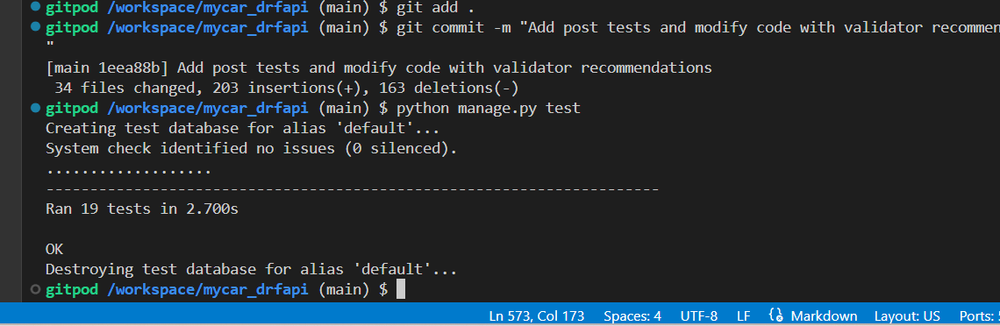
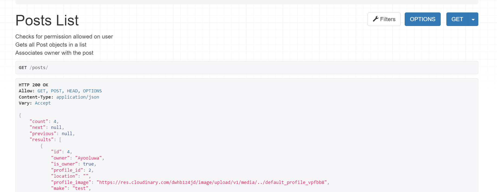
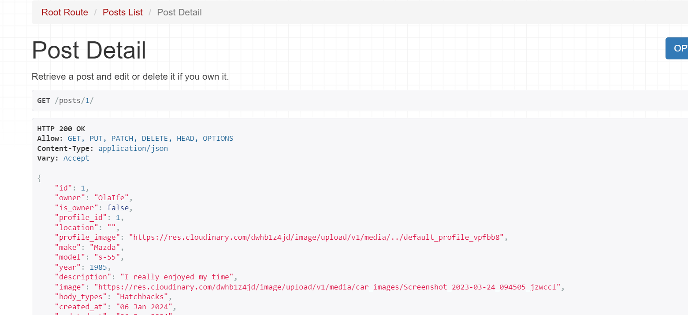
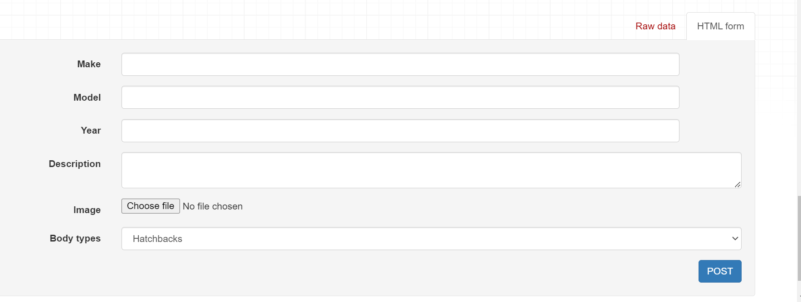
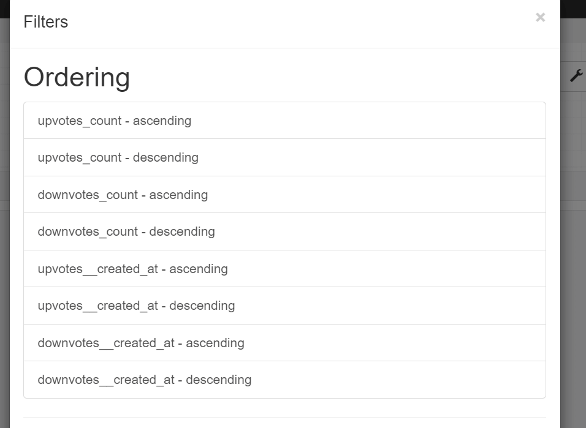
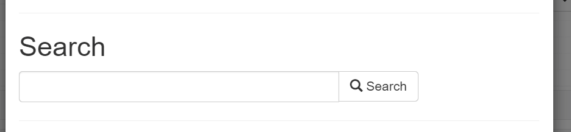
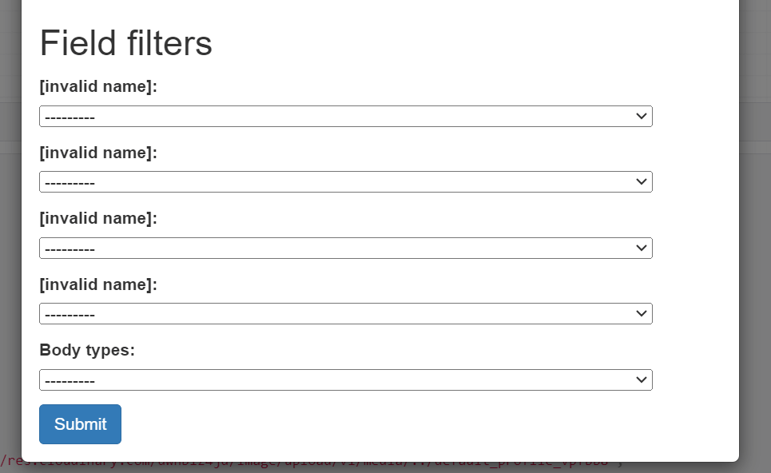
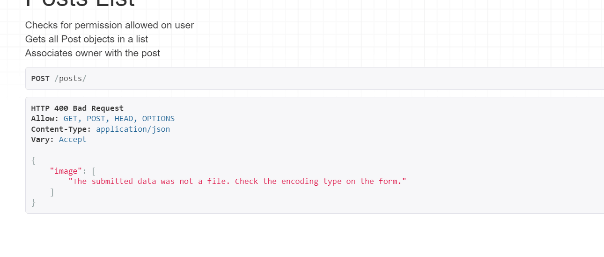

# MyCar API - *Get Updates on Cars*

[View code here](https://github.com/belovedpearl/mycar_drfapi)

[View live site here](https://mycardrfapi-d64556077ed4.herokuapp.com/)

---

**Table of Contents:**

---

 * [Scope](#scope)  
 * [Agile Project Management](#agile-project-management)
 * [User Stories](#user-stories)
 * [Features](#features)
 * [Database Model](#database-model)
     * [Database Representation](#database-representation)
     * [Profile Class](#profile-class)
     * [Post Class](#post-class)
     * [Reviews Class](#reviews-class)
     * [Upvote and Downvote Class](#upvote-and-downvote-class)
     * [Follower Class](#follower-class)
* [Testing](#testing)
 
* [Technology Used](#technology-used)
    * [Languages](#languages)
    * [Python Modules and Packages Used](#python-modules-packages-used)
* [Framework and Tools](#frameworks-and-tools)
* [Development and Deployment](#development-and-deployment)
* [How to Fork](#how-to-fork)
* [How to Clone](#how-to-clone)
* [Testing](#testing)
* [Tools](#tools)
* [Credits](#credits)
* [Acknowledgement](#acknowledgement)

---
# Scope
---

The scope of this project is to build an application programming interface (API) using python Django Rest framework which will be used with a REACT frontend to promote discussions on different cars.

MyCar API provides a backend database to create, view, edit and delete user's related posts, reviews and votes. A user can publish a  car post, including detailed content, an image, and other neccessary information required to make the post.

The API also includes search and filter logic to improve user experience, and make it easier for users to find car posts of different interest.

Key features will include:

**Profile Creation:** This will be handled by signal which will allow automatic creation of prifile on new user addition.

**Login/Logout Functions:** Users will be able to login and logout from the API

**Uniform Interface:** Endpoints for different resources will be unique from the other to allow for network protocols like DELETE, PUT, GET for different http methods.

**User Authentication:** The api will use the Django AllAuth library to enable user account creation and login functionality. Once registered and logged in.

**Post Management:** The API will manage posts from users in a way that it is made available on request in JSON format.

**Post Engagement Records:** From the frontend, users can submit different expressions about cars, the API stores up the different records.

**Deletion:** Registered users will have the ability to delete their contributions to the platform and removed from the API as they wish (i.e posts, upvotes, downvotes, comments).

**Update Contributions:** The API will allow users to update posts and comments contributed by users and thereby updating the same on the platform.

By implementing these features, 'MyCar' aims to foster an engaging community for Car enthusiast.

View the live API [here](https://mycardrfapi-d64556077ed4.herokuapp.com/)

---

# Agile Project Management
---

This backend project was managed using agile methodologies by using different user stories to manage and build the project to give the final outcome. A kanban board was setup in github projects, it was utilised as a management tool to help in the development process.

The Kanban board can be viewed [here](https://github.com/users/belovedpearl/projects/8)

(screenshot of kanban board)

---

# User Stories

Users here refers to the developer or the superuser that have access to the backend site as the project is majorly an API to store data from the frontend.
Users story also illustrate how frontend users are able to interact with the API.

Developers users stories are summarised with the different endpoints exposed below;

## Profiles

As a user, I can view a list of all profiles so that I can see all the profiles that have been created on the API

As a user, I can view the details of one profile so that I can access more information about the individual profile.

As a user, I can edit my profile when logged in so that I can update my personal information.

## Posts

As a user, I can view a list of all posts so that I can see all posts available.

As a user, I can view a post details so that I can access more details about the post including its reviews.

As a user, I can create a new post so that this post will be added to the posts list available.

As a user, I can update a post that I created so that I can change any incorrect information on the post

As a user, I can delete a post that I created so that I can remove the posts from the API.

## Reviews

As a user, I can add a review to a post so that I can link my review to a post thereby expressing my view about the post.

As a user, I can view a list of all reviews so that I can see all reviews created for different posts on the API.

As a user, I can access a single review by id so that I can delete this update the review.

As a user, I can edit a review that I created so that I can amend any incorrect information passed accross.

As a user, I can delete a review I created so that I can remove the review from the API.

## Upvotes

As a User, I can upvote a vote so that I can express positive remarks about a car post.

As a User, I can see upvotes list on the api so that I can see all upvotes created on the api.

As a User, I can remove my upvote so that I can change my mind about a car post.

As a User, I cannot add an upvote to a post when I already downvoted the same post.

## Downvotes

As a User, I can downvote a post so that I can express nagative impression about a car post.

As a User, I can see downvotes list on the api so that I can see all downvotes created on the api.

As a User, I can remove my downvote so that I can change my mind about a car post.

As a User, I cannot add an downvote to a post when I already upvoted the same post.

## Followers

As a User, I can follow other users so that I can get updated with their posts.

As a User, I can delete my follow so that I can change my mind about following another user.

## Search and Filter

As a User, I can search posts with keywords like (model, make, name) so that I can get posts I am intrested in on time.

As a User, I can filter posts by category (body_types) so that I can view car posts relating to a particular category of interest.

---

# Features

---
This section discusses the features and the different endpoints on project 'My Car', the choices made.

## Homepage

On first visit to the API site, you are directed to the Root Route homepage. The home page consist of a welcome message to the API. This can be accessed via [live site](https://mycardrfapi-d64556077ed4.herokuapp.com/).

## Profiles Data

This can be accessed via [profile list](https://mycardrfapi-d64556077ed4.herokuapp.com/profiles/). It contains a list of all registered profiles on the API created on successful user registration. A model is defined to determine the structure of required profile data inheriting from django model.Model class rendered with ProfileList inheriting from django generics.ListAPIView.
A function is added to automatically create a new profile when a new user is created using the [post_save](https://docs.djangoproject.com/en/5.0/topics/signals/) signals

Sceeenshot of Profile Data page on the live site

    

## Posts Data

This can be accessed via [post list](https://mycardrfapi-d64556077ed4.herokuapp.com/posts). This stores up a list of all posts on the API. Users are able to create a new post, update their posts and delete their posts. A model is also defined to determine the post structure using the django model.Model class and rendered using the PostsList view inheriting from [generics.ListCreateAPIView](https://www.django-rest-framework.org/api-guide/generic-views/#listcreateapiview).

Sceeenshot of Posts Data page on the live site

    

## Reviews

This can be accessed via [review list](https://mycardrfapi-d64556077ed4.herokuapp.com/reviews/). This contains a list of all reviews that users have provided on the API. Each review is linked to a post. Users can add, edit and delete their reviews as desired.

Sceeenshot of Reviews Data page on the live site

    

## Upvotes

This can be accessed via [upvotes list](https://mycardrfapi-d64556077ed4.herokuapp.com/upvotes/). This contains a list of all upvotes that users have provided on the API. Each upvote is linked to a post and each upvote is identified by a unique id. Users can add, view and delete their upvotes as desired. Users cannot add a upvote if they already have a downvote on a post, also users are prevenyed from creating multiple upvotes on a post.

Sceeenshot of Upvotes page on the live site

    

## Downvote

This can be accessed via [downvote list](https://mycardrfapi-d64556077ed4.herokuapp.com/downvotes/). This contains a list of all downvotes that users have provided on the API. Each downvote is linked to a post and each downvote is identified by a unique id. Users can add, view and delete their downvotes as desired using the django views [this](https://www.django-rest-framework.org/api-guide/generic-views/#listcreateapiview) and [this](https://www.django-rest-framework.org/api-guide/generic-views/#retrievedestroyapiview). Users cannot add a downvote if they already have an upvote on a post, also users are prevented from creating multiple downvote on a post.

Sceeenshot of Downvotes page on the live site

    

## Followers

This can be accessed via [followers list](https://mycardrfapi-d64556077ed4.herokuapp.com/followers/). This contains a list of all follows that users have created on the API. Authenticated users can view the followers list, create a follow and delete a follow using (this)[https://www.django-rest-framework.org/api-guide/generic-views/#listcreateapiview] and (this)[https://www.django-rest-framework.org/api-guide/generic-views/#retrievedestroyapiview] view. Users are prevented from creating multiple follow for a profile. Each created follow is linked to a profile and can be identified by a unique id.

Sceeenshot of Followers list on the live site

    

---

# Database Model

---

## Database Representation

This section shows a representation of user structure and the database used in the buildup of MyCar project. Six apps were created to expose different endpoints to be used in the frontend.

## Profile Class

The is used as a template to add and update user's profile, with this model users profile details are stored up in the API.

|Field | Details|
|---   | --------
|Owner | A one to one field linked to the user. Deleting the user will have a cascade effect on all posts made by the user (on_delete=models.CASCADE) |
|Location | CharField with maximum length set to 255, blank is set to true to allow empty values to be used.|
| Name | CharField with maximum length set to 255, blank is set to true to allow empty values to be used.|
|Job_title| CharField with maximum length set to 255, blank is set to true to allow empty values to be used.|
|Current_employer| CharField with maximum length set to 255, blank is set to true to allow empty values to be used.|
|Image| An image field. If users fail to provide an image it is set to the default placeholder.|
|About| A textfield, blanl property set to true to allow empty values to be used.|
|Date Created | Sets the date the post is made. It is set to auto_now_add=True so that exact time of creating the post can be recorded.|
| Date Updated | Sets the date any update is made on the post.|

### Profile Class Methods

* The first been the Meta class which returns the ordering of posts in descending order of creation to allow for latest profile first.
* A string method returning the profile owner.

### Create Profile Function

Profile creation is set to be handled automatically when a new user successfully registers, it uses the [post_save](https://docs.djangoproject.com/en/5.0/ref/signals/) signal to create a new profile everytime.

## Profile View

### ProfileList View & Serializer

Using the [ListAPIView](https://www.django-rest-framework.org/api-guide/generic-views/#listapiview) the list of all profiles can be viewed ordered in the descending order of creation. I have setup a count for posts, following, followers, upvotes, downvotes. A profile serializer class has also been setup to handle profile model instances.

 I have added two filterset fields for;

* Profiles that are following the logged in user
* Profiles that are being followed by the logged in user

I have also added the following fields to the returned JSON data:

* is_owner
* following_id
* posts_count
* followers_count
* following_count
* upvotes_count
* downvotes_count

### ProfileDetail View & Serializer
With defined permission, users are able to access profile details. Profile owners are allowed to access the SAFE methods on this view. It uses the setup ProfileSerializer. Using the [RetrieveUpdateAPIView](https://www.django-rest-framework.org/api-guide/generic-views/#retrieveupdateapiview), users can get the details of a profile and update it.

---

## Post Class

The is used as a template to add and update a post, with this model post details are stored up in the API.

|Field | Details|
|---   | --------
|Owner | A foreign field linked to the user. Deleting the user will have a cascade effect on all posts made by the user (on_delete=models.CASCADE) |
|Make | CharField with maximum length set to 255|
| Model | CharField with maximum length set to 255|
|Year| Positive integer field|
|Image| An image field. Users are always required to add an image|
|Description| A textfield, takes the post authors description of his experience with the car.|
| Body types | CharField with maximum length set to 50, Choices set to car_types (already defined), a default set to hatchbacks
|Date Created | Sets the date the post is made. It is set to auto_now_add=True so that exact time of creating the post can be recorded.|
| Date Updated | Sets the date any update is made on the post.|

### Post Class Methods

* The first been the Meta class which returns the ordering of posts in descending order of creation to allow for latest posts first.
* A string method returning the post id, make and model for easy recognition of the post..

## Post View

### PostList View & Serializer

Using the [ListCreateAPIView](https://www.django-rest-framework.org/api-guide/generic-views/#listcreateapiview) the list of all posts can be viewed ordered in the descending order of creation.The view also allows for post creation. Permission classes is used to allow authenticated users access the different methods. I have setup a count for upvotes, downvotes and reviews associated by each post. A post serializer class has also been setup to handle post model instances.

I have added search field function for easy and quick access to posts required by users;

* ^make - Starts with make
* ^model - Starts with model
* owner_username - Search with post author name
* ^body_types - Starts with body type
* year - Contains year

I have also added the following filterset fields to the posts:

* Posts whose owners the user is following - to be used in the front end 'Feed' page
* Posts that have been upvoted by the user - to be used on the profile page
* Posts that have been downvoted by the user - to be used on the profile page
* Posts created by the user - to be used on the profile page
* Body types

### PostDetail View & Serializer
With defined permission, users are able to access post details functions. Post owners are able to access the SAFE methods on this view. It uses the setup PostSerializer. Using the [RetrieveUpdateDestroyAPIView](https://www.django-rest-framework.org/api-guide/generic-views/#retrieveupdatedestroyapiview), users can get the details of a post, update and delete it. For more details to be made available, I have added counts for upvotes, downvotes and reviews on the post detail page.

---

## Review Class

The is used as a template to add and update a review, with this model review details added to a post are stored up in the API.

|Field | Details|
|---   | --------
|Owner | A foreign field linked to the user. Deleting the user will have a cascade effect on all reviews made by the user (on_delete=models.CASCADE) |
|Post | A foreign field linked to the Post. Deleting the Post will have a cascade effect on all reviews taht exists on the post. (on_delete=models.CASCADE) |
|Content| A textfield, takes the desired text of the user to the post.|
|Date Created | Sets the date the review is made. It is set to auto_now_add=True so that exact time of creating the review can be recorded.|
| Date Updated | Sets the date any update is made on the review.|

### Review Class Methods

* The first been the Meta class which returns the ordering of reviews in descending order of creation to allow for latest reviews first.

### ReviewList View & Serializer

Using the [ListCreateAPIView](https://www.django-rest-framework.org/api-guide/generic-views/#listcreateapiview) the list of all reviews can be viewed ordered in the descending order of creation.The view also allows for review creation. Permission classes is used to allow authenticated users access the SAFE methods. I have setup a filter backend to filter reviews by post. A Review serializer class has also been setup to handle review model instances.
A perform_create method was used to set the owner field as the current user before it os saved to the database.

### ReviewtDetail View & Serializer
With defined permission, users are able to access review details functions. Review owners are able to access the SAFE methods on this view. It uses the setup ReviewDetailSerializer. Using the [RetrieveUpdateDestroyAPIView](https://www.django-rest-framework.org/api-guide/generic-views/#retrieveupdatedestroyapiview), users can get the details of a review, update and delete it.

---

## Upvote and Downvote Class

The is used as a template to add and remove upvote/downvote to a post, with this model user's expression about a post are stored up in the API.

|Field | Details|
|---   | --------
|Owner | A foreign field linked to the user. Deleting the user will have a cascade effect on all upvotes/downvotes created by the user (on_delete=models.CASCADE) |
|Post | A foreign key linked to the associated post. It has its related names set to upvotes/downvotes to allow for easy recognition, deleting a post will remove all associated upvotes/downvotes in the API (on_delete=models.CASCADE)|
|Date Created | Sets the date the upvote/downvote is made. It is set to auto_now_add=True so that exact time of creating the upvote/downvote can be recorded.|

### Upvote/Downvote Class Methods

* The first been the Meta class which returns the ordering of upvotes/downvotes in descending order of creation to allow for latest upvote/downvote first.
* On the Meta class, there is the defined unique_together which ensures that each user can only have one upvote/downvote to a post.
* A string method returning the string containing the make and model of the car upvoted/downvoted

## Upvote/ Downvote View

### UpvoteList/DownvoteList View & Serializer

Using the [ListCreateAPIView](https://www.django-rest-framework.org/api-guide/generic-views/#listcreateapiview) the list of all upvotes/downvotes can be viewed ordered in the descending order of creation.The view also allows for upvote/downvote creation. Permission classes is used to allow authenticated users access the different methods.

A perform_create method was setup to ensure that a user can upvote/downvote a post only if they haven't already downvoted/upvoted it. It also adds custom logic to the creation process based on the project requirement.

### UpvoteDetail/DownvoteDetail View & Serializer
With defined permission, users are able to access upvotes/downvotes details functions. Upvotes/Downvotes owners are able to access the SAFE methods on this view. It uses the setup UpvoteSerializer. Using the [RetrieveDestroyAPIView](https://www.django-rest-framework.org/api-guide/generic-views/#retrievedestroyapiview), authors can get the details of an upvote/downvote and delete it.

---

## Follower Class

The is used as a template to add and remove follow to a profile, with this model user are able to follow another profile and details are stored up in the API.

|Field | Details|
|---   | --------
|Owner | A foreign key linked to the user. Deleting the user will have a cascade effect on all follows created by the user (on_delete=models.CASCADE). It has a related name property following. |
|Followed | A foreign key linked to the associated User. It has its related names set to 'followed' to allow for easy recognition, deleting a User will remove all associated followed created in the API (on_delete=models.CASCADE)|
|Date Created | Sets the date the follow was made. It is set to auto_now_add=True so that exact time of creating the follow can be recorded.|

### Follower Class Methods

* The first been the Meta class which returns the ordering of follow in descending order of creation to allow for latest follow listed first.
* On the Meta class, there is the defined unique_together which ensures that each user can only create one follow to a user.
* A string method returning the string containing the owner's username and the followed username.

## Follower View

### Follower View & Serializer

Using the [ListCreateAPIView](https://www.django-rest-framework.org/api-guide/generic-views/#listcreateapiview) the list of all follows created can be viewed.Authenticated user's have access to safe methods on this view and the view also allows for follower's creation.

A perform_create method was setup to ensure setting the owner field of the model to the current user before saving it to the database.

### FollowerDetail View & Serializer
With defined permission, users are able to access follower details functions.Follower creators are able to access the SAFE methods on this view. It uses the setup FollowerSerializer. Using the [RetrieveDestroyAPIView](https://www.django-rest-framework.org/api-guide/generic-views/#retrievedestroyapiview), authors can get the details of a follower and delete it.

---

# Testing 

---

## Automatic Testing

I have been able to write 14 tests for this project.

## Manual Testing

The following tests were carried out manually on the projects. Different endpoints were tested to see if they fufil their functions as described.

### Posts

|Test | Expected Action | COMMENT |
|---   | --------| --- |
|Adding the /posts to the url should open up the post list. | Post list was visible on adding the posts endpoint | PASS
|Adding post id to the url opens up the post detail page | Post detail page was visible.| PASS |
| Filter button visible to users | Filter button should be visible | PASS |
| Clicking on the Filter button shown| Filter options, search and filter field should be shown to shown to users | PASS |
| Allow post creation by authenticated users | Add post form should be visible below the post list | PASS |
|Disallow post creation by nonauthenticated users | Add post form shoild not be visible to unauthenticated users | PASS |
| Disallow post creation without an image | Users should see an error message regarding the empty image field | PASS |
| Edit post | Post detail should be editable | PASS |
|Delete post | Post should be removed from the list if the delete button is clicked | PASS |

Sceeenshot of Manual Posts test done

    
    
    
    
    
    
    

### Reviews

---

# Technologies Used

## Languages

[Python](https://en.wikipedia.org/wiki/Python_(programming_language))- Used to set up the main functionality of this part of the project.

## Python Packages Used

 Some of the several python packages used to execute the project are illustrated below;

 * psycopg2 - PostgreSQL database adapter used for python programming language.
 * django-allauth - This is an integrated set of django applications that handles registration, authentication, registration, account management e.t.c

## Framework and Tools

* [Django Rest Framework](https://www.django-rest-framework.org/)- Used to build the API
* [Github](https://www.github.com/) - Used to host the repository, save commits and to manage the project development to achieve the different user stories.
* [Gitpod](https://www.gitpod.com) - This was used to write code, correct code, commiting and pushing code up to github.
* [Heroku](https://www.heroku.com/) - Used for holding the deployed version of the project.
* [Cloudinary](https://www.cloudinary.com/) - Used to hold images files used.
* [Lucid Chart](https://lucid.app/documents#/documents?folder_id=recent) - This was used for creating the website ERD, a demonstration of the database structure.

## Libraries Used

As listed in the requirements file, the libraries used for this project include the following;

* asgiref - ASGI indeed facilitates communication between asynchronous web applications and servers in Python.

* cloudinary - This enabled seamless integration of applications with Cloudinary, a cloud-based media management solution.

* dj-database-url - This enabled the ability to leverage the DATABASE_URL environment variable, which follows the principles outlined in the Twelve-Factor App methodology.

* dj-rest-auth - This package provides drop-in API endpoints specifically designed to handle authentication securely in Django Rest Framework (DRF) applications. It simplify the procass of authentication like signin, signout, password change e.t.c

* Django - Django is a high-level Python web framework that encourages rapid development and clean, pragmatic design.

* django-allauth - django-allauth is a comprehensive set of Django applications that addresses various aspects of user authentication, registration, account management, and third-party (social) account authentication within Django web applications.

* django-cloudinary-storage - This is a package designed to streamline the integration of Cloudinary, a cloud-based media management solution, with Django projects.

* django-cors-headers - Django application designed to facilitate Cross-Origin Resource Sharing (CORS) in Django projects by adding appropriate CORS headers to HTTP responses.

* django-filter - This is a reusable Django application that provides the ability and capability to add dynamic QuerySet filtering based on URL parameters in Django projects. 

* djangorestframework - This is a web-browsable Web APIs.

* djangorestframework-simplejwt - This allows the implemention of token-based authentication RESTful APIs and web applications.

* gunicorn - This is a Python WSGI HTTP Server for UNIX. The Gunicorn server is broadly compatible with various web frameworks, simply implemented, light on server resource usage, and fairly speedy. This is also known as ‘Green Unicorn’.

* oauthlib - This framework was designed to facilitate the implementation of OAuth 1.0a and OAuth 2.0 protocols in Python-based applications.

* pillow - Python Imaging Library that adds image processing capabilities to Python interpreter.

* psycopg2 - This is the most popular PostgreSQL database adapter for Python programming language.

* PyJWT - A Python library that provides support for encoding, decoding, and validating JSON Web Tokens (JWTs) according to the specifications outlined in RFC 7519.

* python3-openid - A Python library that enables support for OpenID authentication in modern server and consumer applications.

* pytz - This is a Python library that provides timezone definitions and utilities to work with them. It allows Python developers to handle timezone-aware datetime calculations and conversions accurately across different timezones.

* requests-oauthlib - It offers OAuth support for applications built with the Requests HTTP library. It simplifies the process of integrating OAuth authentication into Python applications that use the Requests library for making HTTP requests.

* sqlparse - This is a Python library designed for parsing SQL queries.

---

# Deployment

---

The project was deployed to [heroku](https://heroku.com), to view the live project click [here](https://mycardrfapi-d64556077ed4.herokuapp.com/)

## Creating the Project

1. To start, create a GitHub repository from the [Code Institute](https://github.com/Code-Institute-Org/gitpod-full-template) template and then click 'Use this template'.

2. Add a name for your new repository and then click 'Create Repository'.

3. Once the repository is created, click on the 'Gitpod' button to open it up in a gitpod editor.

4. Install django and the supporting libraries using the following commands.
    
     * pip3 install 'django<4' gunicorn
     * pip3 install 'dj_database_url psycopg2
     * pip3 install 'dj3-cloudinary-storage

5. Create and update requirements file.

     * pip3 freeze --local > requirements.txt
    
6. Create the project using the following command

     * django-admin startproject PROJECT_NAME
    
7. Applications can be created using the following command,

     * python3 manage.py startapp APP_NAME

  I have used the following applications in my project; Profiles, Posts, Reviews, Upvotes, Downvotes and Followers.
 
 8. Add the applications to project's settings file in the INSTALLED_APPS list. 

 9. Define models in the applications with your desired field.

 10. After defining models, run the migration using the commands below;

      * python3 manage.py makemigrations
      * python3 manage.py migrate
    To view the live server, run the command below;

      * python3 manage.py runserver
      
    Click on the open browser button to view django's template view.

## Heroku App

1. Signin to your [heroku](https://id.heroku.com/login) account/ [create](https://signup.heroku.com/identity) an account.

2. Click on the button 'New' to create a new app.

3. Choose a unique app-name for your app.

4. Choose your region.

5. Click 'Create app'.

6. Follow the steps illustrated below to create a database 

7. In the Heroku app settings section, click on 'Reveal Config Vars'. 

8. Create a config variable called DATABASE_URL and paste in the URL copied from ElephantSQL to connect the database to the app.

## Setting up a Database

To setup an external database using the ElephantSQL, follow the following steps;

1. [Log in](https://customer.elephantsql.com/login) to your account / [Create](https://customer.elephantsql.com/signup) a new account.

2. On your dashboard, click on 'Create New Instance' to create a new database instance.

3. Choose a name for your database instance.

4. Select the data center near you.

5. Click 'Create Instance'.

6. Back in the dashboard, click on your new instance name, copy the Database URL (to be used in heroku)

## Cloudinary Setup

Cloudinary is used to store static files.

1. [Create](https://cloudinary.com/users/register_free) a Cloudinary account/ [Login](https://cloudinary.com/users/login) into an existing account and from the dashboard copy the API Environment Variable.

2. In the env.py file add the Cloudinary url

     * os.environ["CLOUDINARY_URL"] = "cloudinary://************************"
    
3. In the Heroku settings add the Cloudinary url in Config Vars. 

4. Add a disable collectstatic variable to get the first deployment successfully to Heroku.

5. In the settings.py file, add the Cloudinary Libraries installed to the INSTALLED_APPS list. 

    Note: It is important to add the apps in the following order;

     *  cloudinary_storage
     *  django.contrib.staticfiles
     *  cloudinary

## Environment Variable Setup

1. In GitPod and create an env.py file in the top level directory. Add the following

     * import os
     * os.environ["DATABASE_URL"] 
     * os.environ["SECRET_KEY"] 

   The database URL is the value copied from the database setup above and the secret key can be anyword as desired by the developer.

2. In the config var section of the app on heroku, create another variable called SECRET_KEY (copy in the same secret key added into the env.py file). 

3. Add the env.py file into the .gitignore file to keep the off github.

4. To connect the env file and the settings, add the following to the settings file.

      * import os

      * import dj_database_url

      * if os.path.isfile("env.py"):

          import env

5. In the settings file, remove the already exposed secret key.

6. Add SECRET_KEY = os.environ.get('SECRET_KEY') to linkup the file with the env secret key.

7. Also, comment out the DATABASE_URL in the settings file replace with the DATABASE_URL in the env file.

      * DATABASE_URL = os.environ.get('DATABASE_URL')

8. Save all fields and migrate changes.
     
      * python3 manage.py migrate

## More Settings for Django

* For static files storage and usage with django add the following to the settings.py file.

     * STATIC_URL = '/static/'

* Add in 'localhost' and APP_NAME to the ALLOWED_HOSTS list.

     * ALLOWED_HOSTS = ['mycar.herokuapp.com', 'localhost']

* Create a *Procfile and add the line below;
    
     * release: python manage.py makemigrations && python manage.py migrate
       web: gunicorn PROJECT_NAME.wsgi  

After adding all the above settings,

Save, commit and push to github using the following commands;
     
      git add
      git commit -m 'Commit message'
      git push

To deploy,

*  Go back to heroku and click on your app instance

* Click the 'Deploy' tab. 

* Select 'Github' for deployment method. 

* Search for the repository name you want to deploy and then click 'connect'.

* Scroll down to select the manual deployment section

* Click 'Deploy Branch'. Watch the deployment build up

* Once completed, click on the 'view site' to see the deployed version.

---

# How to fork

---

By forking a repository, you make a copy of a repository without affecting the original repository. You can fork this repository using the following steps.

* Log in to GitHub and locate the [GitHub repository](https://github.com/belovedpearl/mycar_drfapi).
* At the top of the Repository above the "Settings" Tab on the menu,
       * locate the "Fork" Button
       * Click it.
* You will have a copy of the original repository in your GitHub account.
* Doing this will allow you make changes to your copy and keep the original safe.

---

# How to Clone

---

* Log into GitHub and locate the [Github repository](https://github.com/belovedpearl/mycar_drfapi).

* Click the 'Code' dropdown at the right of the 'Open' button.

* Copy the URL for the repository.

* Open Git Bash in your IDE.

* Change the current working directory to your desired location.

* Type git clone in the CLI and then paste the URL you copied.

     * $ git clone https://github.com/

* Press Enter to create your local clone.

NOTE- You will need to install all of the packages listed in the requirements file. Use the following command in the terminal

      pip install -r requirements.txt 

to install required packages.

* Finally create the environment file so that the project identifies variables that it requires. Environment variables are usually hidden due to sensitive information and need not be added to github. Ensure the env file is added to the gitignore file. 

The variables declared in the env.py file needs to be added to the Heroku config vars.

Perform all neccessary migrations 

      python3 manage.py migrate

Run the server.

      python3 manage.py runserver

---

# Credits

* The default profile picture used was from '[Mungfali](https://mungfali.com/explore/Default-Photo)'

* Project inspiration from 'Code Institute DRF project'.

---

# Acknowledgments

My special thank you goes to the following:

My husband Adegoke, for his encouragement and support along the way. I do cherish all of your support during this period.

My kids (my boys), for allowing mummy time out to read and code.

